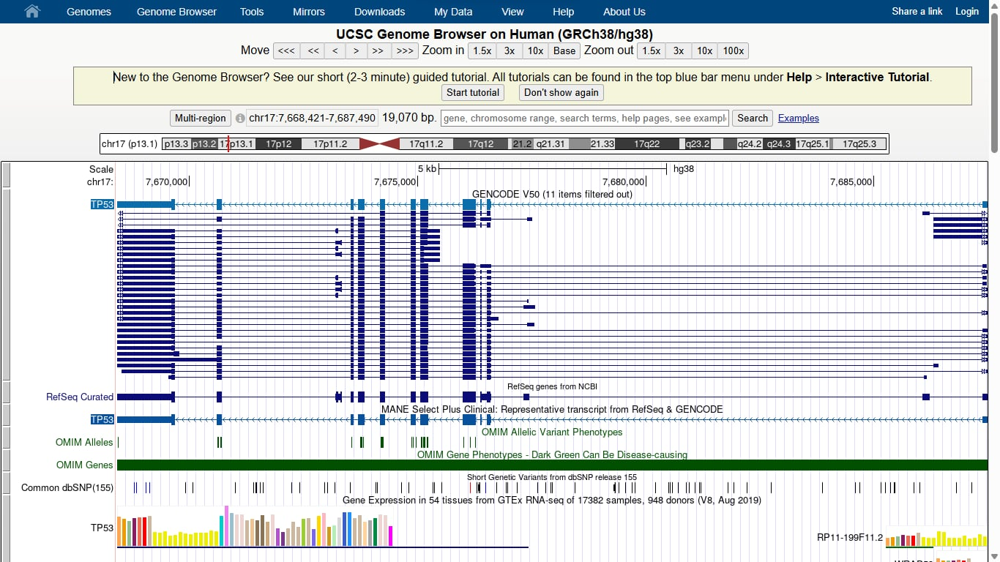
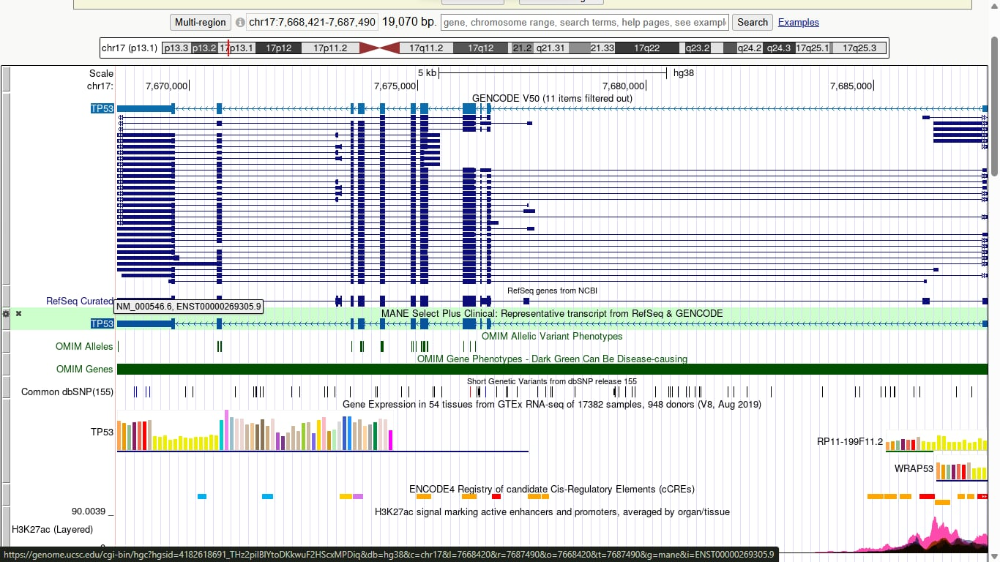
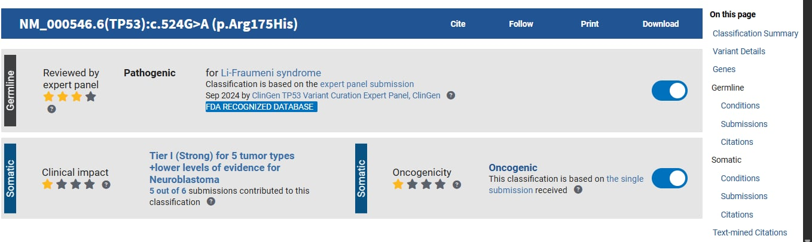
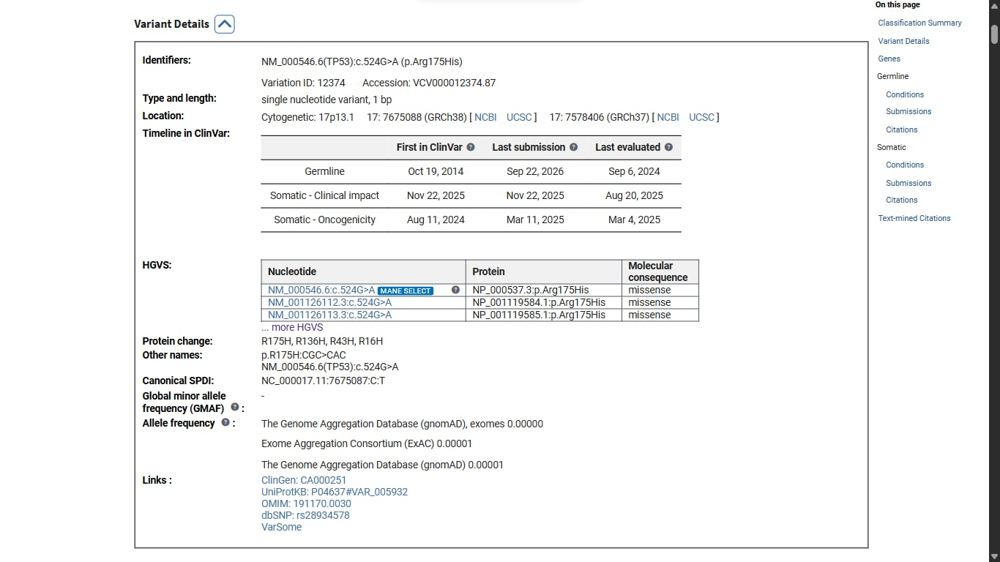
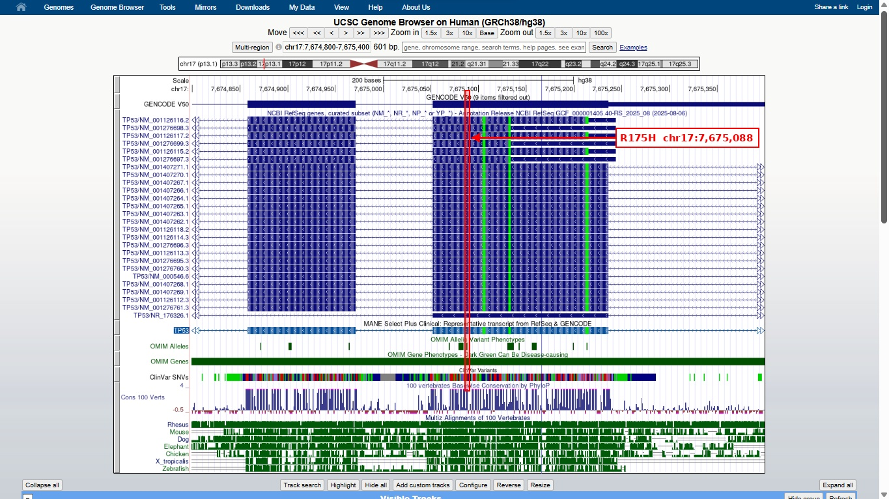
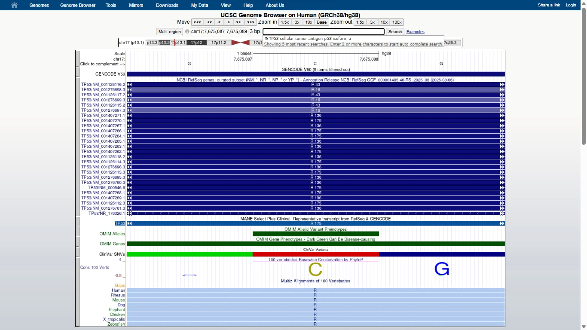

# Exploring a Human Disease Gene Using UCSC Genome Browser and NCBI ClinVar

**Name:** Rhealyn F. Alama

**Assigned gene:** TP53

**Associated disease:** Li-Fraumeni syndrome

---

## 1. UCSC Gene Location (Part B)

* Official gene symbol: TP53
* Full gene name: tumor protein p53
* Chromosome: 17 (17p13.1)
* Genome assembly: GRCh38/hg38
* Genomic coordinates: chr17:7,668,421-7,687,490
* Strand: minus (-)
* Approximate gene size: 19,070 bp (about 19 kb)

**Screenshot 1: Gene location**

---

## 2. Exons, Introns, and Transcripts (Part C)

**Selected transcript:** NM_000546.6 (ENST00000269305.9), MANE Select Plus Clinical

**a. Number of exons identified in the selected transcript:** 11 exons. UCSC's feature details for this transcript show "Exon 11 of 11". Because TP53 is on the minus strand, exon 1 is at the right end of the gene and exon 11 is at the left end.

**b. Multiple transcripts/isoforms visible:** Yes. The GENCODE V50 track shows many horizontal rows for TP53. They differ in which exons they include and where the exons begin and end, which means TP53 produces multiple transcript isoforms.

**c. Difference between an exon and an intron:** An exon is a part of a gene that is kept in the mature mRNA after splicing, and most exons contain the code for the protein. An intron is a stretch of sequence between exons that is copied into the pre-mRNA but cut out during splicing, so it is not in the final mRNA or the protein.

**d. Are introns generally longer or shorter than exons in TP53?** Introns are generally longer. In the browser, the exons appear as small boxes and the introns as the long lines connecting them. Most of TP53's 19 kb span is intron, and most exons are only a few hundred base pairs or less. The exception is exon 11 (1,270 bp), which is the longest exon.

**Screenshot 2: Gene structure**

---

## 3. UCSC Annotation Tracks (Part D)

**a. Gene annotation track used:** MANE Select Plus Clinical (NM_000546.6), with GENCODE V50 and NCBI RefSeq (curated) also displayed.

**b. Were ClinVar-related variant marks visible within or near TP53?** Yes. The ClinVar SNVs track showed many colored marks across the gene. They were densest over the coding exons in the middle of the gene, with fewer in the introns and in the regions on either side.

**c. Were some regions more conserved than others?** Yes. The 100 Vertebrates PhyloP track had tall peaks in some regions and low, flat signal in others.

**d. Did conserved regions correspond mainly to exons, introns, both, or another region?** The tallest conservation peaks lined up mainly with exons in the middle of the gene. The introns and the ends of the gene showed lower conservation, with a few small peaks.

**e. Why strong conservation can suggest biological importance:** When a DNA sequence stays nearly the same across many different species, it usually means that sequence has an important function. Changes (mutations) in such regions are likely to harm the organism, so natural selection removes them over time. This is why the highly conserved exons of TP53 are likely to encode parts of the protein that are essential for its function.

**Screenshot 3: TP53 with ClinVar and Conservation tracks**

---

## 4. Selected ClinVar Variant (Part E)

* a. Gene: TP53
* b. Variant name (HGVS): NM_000546.6(TP53):c.524G>A (p.Arg175His)
* c. rsID / ClinVar ID: rs28934578 / VCV000012374.87 (Variation ID 12374)
* d. Chromosome and position (GRCh38): chr17:7,675,088 (17p13.1)
* e. Associated condition: Li-Fraumeni syndrome
* f. Clinical significance (as reported by ClinVar): Pathogenic (germline)
* g. Review status: Reviewed by expert panel (3 stars); ClinGen TP53 Variant Curation Expert Panel, Sep 2024
* h. ClinVar record URL: (https://ncbi.nlm.nih.gov/clinvar/variation/12374/?term=%22NM_000546.6%3Ac.524G%3EA%22%5BVARNAME%5D)

**Screenshot 4: ClinVar variant record**

---

## 5. Locating the Variant in UCSC (Part F)

I searched chr17:7,675,088 (GRCh38) in the UCSC Genome Browser, the same assembly used for ClinVar and for my gene coordinates, and kept the ClinVar SNVs track visible.

**a. Where is the variant located relative to the gene?** The variant is at chr17:7,675,088, inside TP53 in exon 5 of 11 of the MANE transcript NM_000546.6. In the browser it lies in the right-hand of two neighboring exons, close to the exon's left edge, because the gene runs right to left on the minus strand.

**b. Is it in an exon, intron, UTR, splice region, or another region?** It is in an exon. It is not in a UTR, and it is about 35 bp from the exon boundary, so it is not in the splice region.

**c. Is it likely in a coding or non-coding region based on the displayed annotations?** Coding. All the TP53 RefSeq rows label this position as codon R175, so the variant is in the protein-coding sequence.

**Screenshot 5: Variant located in UCSC relative to the gene model**

**Supporting view: the R175 codon (3 bp)**

---

## 6. Interpretation (Part F, continued)

**d. How the variant might affect the gene or gene product:** c.524G>A (C>T on the plus strand, since TP53 is on the minus strand) changes the codon CGC to CAC, so arginine at position 175 is replaced by histidine (p.Arg175His). This is a missense change in the DNA-binding domain of the p53 protein, so it likely reduces the ability of p53 to bind DNA and switch on its target genes. This fits with ClinVar's Pathogenic classification for Li-Fraumeni syndrome. The Multiz alignment also shows arginine at this position in species from human to zebrafish, which suggests it is important to the protein.

**e. Additional evidence needed before concluding that the variant causes disease:** Functional assays showing that the p53 protein loses its activity, evidence that the variant segregates with cancer in affected families, population frequency data showing the variant is rare in healthy people, and independent reports from multiple patients or laboratories.

---

## 7. Reflection (Part G)

**1. What did UCSC show you about your gene that was not obvious from simply reading about the gene's function?**
UCSC showed me the physical structure of TP53: an 11-exon gene on the minus strand of chromosome 17 that spans about 19 kb and is mostly intron. I also saw that it has many transcript isoforms and that its exons are far more conserved than its introns. None of this was clear from reading about what p53 does.

**2. Why is knowing the exact genomic location of a disease-associated variant useful?**
The exact location tells me whether a variant is in an exon, an intron, a UTR, or a splice site, which helps predict if it changes the protein. It also lets me compare the variant with conservation and other tracks, and match the same variant across different databases such as UCSC and ClinVar.

**3. What is one limitation of predicting a variant's effect only from its genomic location?**
Location alone does not show what the change actually does to the protein. Two variants in the same exon can have very different effects, for example a missense change versus a stop codon, so functional and clinical evidence is still needed.

**4. What was the most interesting feature you observed about your assigned gene?**
The most interesting feature was that the ClinVar variants clustered in the same coding exons that are highly conserved. The R175 codon is also conserved from human to zebrafish, and it is the site of a known pathogenic variant.

---

## 8. References and Links

* UCSC Genome Browser: https://genome.ucsc.edu/
* UCSC Genome Browser 101 Tutorial: https://genome.ucsc.edu/docs/tutorials/gb101.html
* NCBI ClinVar: https://www.ncbi.nlm.nih.gov/clinvar/
* ClinVar record used (TP53 c.524G>A, p.Arg175His): https://ncbi.nlm.nih.gov/clinvar/variation/12374/?term=%22NM_000546.6%3Ac.524G%3EA%22%5BVARNAME%5D
* ClinVar Search Help: https://www.ncbi.nlm.nih.gov/clinvar/docs/help/

---

