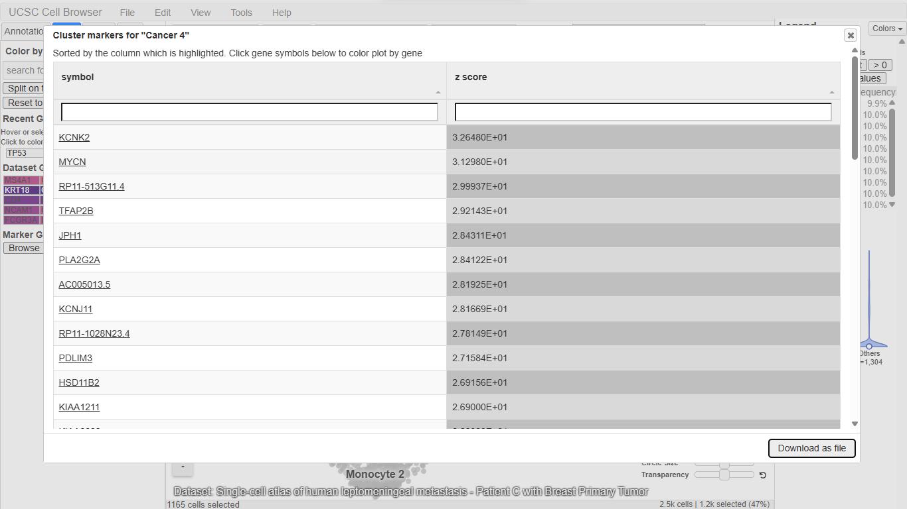
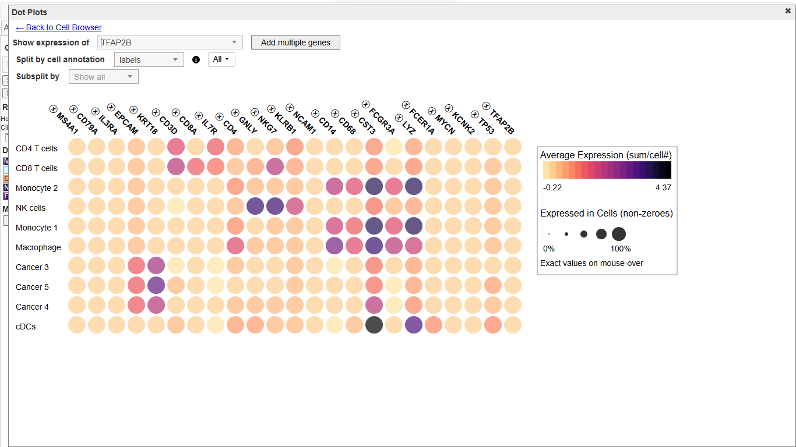

# UCSC Cell Browser Activity
## From Genome to Cell: Exploring Disease Gene Using the UCSC Cell Browser

**Name:** Rhealyn F. Alama
**Assigned gene:** TP53
**Associated disease:** Li-Fraumeni syndrome

---

## 1. Assigned Gene and Disease (Part A)
* Assigned gene: TP53 (tumor protein p53), chromosome 17 (17p13.1)
* Associated disease: Li-Fraumeni syndrome
* This activity continues the previous UCSC Genome Browser and ClinVar activity, using the same gene.

---

## 2. Organ/Tissue Choice and Dataset Information (Part B)
* Dataset name: Single-cell atlas of human leptomeningeal metastasis - Patient C with Breast Primary Tumor
* Organ/tissue: Cerebrospinal fluid (CSF) cell fraction from a patient with a primary tumor in the breast and newly diagnosed leptomeningeal metastasis
* Publication/study: Speir et al. 2021
* Dataset URL: (paste the URL from the address bar; dataset ID lepto-metastasis/patient-c)
* Why this tissue is relevant: Breast cancer is one of the most common cancers in Li-Fraumeni syndrome, which is caused by germline TP53 variants. This dataset comes from a patient with a breast primary tumor, so it contains breast cancer cells together with the immune cells around them. The cells were taken from CSF, not from the breast itself, so the dataset does not represent breast tissue directly.

**Screenshot 1: Selected dataset**

---

## 3. Understanding the Cell Map (Part C)
* a. Type of visualization: UMAP 
* b. What one dot represents: one cell
* c. What the clusters represent: groups of cells with similar expression profiles, which in this dataset correspond to immune cell types and tumor cell populations
* d. Cell types/clusters visible: CD4 T cells, CD8 T cells, Monocyte 1, Monocyte 2, NK cells, Macrophage, Cancer 3, Cancer 4, Cancer 5, cDCs

---

## 4. Assigned Gene Expression (Part D)
* a. Assigned gene symbol: TP53
* b. Dataset used: Single-cell atlas of human leptomeningeal metastasis - Patient C with Breast Primary Tumor
* c. Is expression widespread, restricted, or low/undetected? Low and widespread but sparse. TP53 was detected in a minority of cells (roughly the top 10 to 20%) scattered across almost all clusters. Most cells in every cluster were at baseline.
* d. Clusters with stronger expression: scattered cells in CD4 T cells, CD8 T cells, NK cells, monocytes, and macrophages, and a few cells in the cancer clusters.
* e. Clusters with little or no detectable expression: most cells in every cluster, and the cDCs (only a few cells).

**Screenshot 2: TP53 expression across the cell map**

---

## 5. Cell Types and Clusters (Part E)
* a. Strongest visible expression: cDCs, based on average expression in the dot plot. This cluster has only a few cells, so the result is tentative.
* b. Another cluster with detectable expression: Cancer 5, slightly higher than the other cancer clusters (also a small cluster).
* c. Low or undetected expression: CD4 T cells, CD8 T cells, NK cells, monocytes, macrophages, Cancer 3, and Cancer 4 (pale in the dot plot), and most individual cells in every cluster.
* d. Broad or cell-type restricted: broad, not restricted to one cell type.
* e. Interpretation (based on this dataset only): TP53 is a tumor suppressor involved in the DNA damage response and is used at low levels by many cell types, so a broad, low pattern is expected. The small differences in cDCs and Cancer 5 rest on very few cells, so I cannot conclude that they differ from the other clusters. Single-cell methods also miss many low-level transcripts, so undetected cells may still express TP53.

**Screenshot 3: TP53 expression with cell-type labels**

---

## 6. Expression Plot (Part F)
* a. Cells selected: 1,165 cells (about 47% of the dataset), mainly the CD4 T cell cluster
* b. Compared with the other 1,304 cells: similar. Both groups had most cells at baseline and a thin tail of higher values.
* c. What the plot adds: the map showed where cells with higher TP53 are located, but the violin plot shows the distribution. Most cells have undetected TP53, only a small minority are higher, and CD4 T cells are not enriched compared with the other cells. The dot plot adds the average per cluster, which was low everywhere.

**Screenshot 4: Violin plot and dot plot**

---

## 7. Marker Genes (Part G)
* a. Cluster examined: Cancer 4
* b. Marker gene 1: KCNK2 (z score 32.6)
* c. Marker gene 2: MYCN (z score 31.3)
* d. Marker gene 3: TFAP2B (z score 29.2)
* e. Does TP53 behave like a cell-type marker in this dataset? No. TP53 was not among the top markers of the clusters I checked. Its expression was low in every cluster in the dot plot, and only a minority of cells in each cluster expressed it. A gene can be important in disease without marking a cell type, and TP53 acts in the DNA damage response in many cell types.

**Screenshot 5: Cluster marker genes (Cancer 4)**

---

## 8. Disease Gene vs. Marker Gene (Part H)
* a. Assigned disease gene: TP53
* b. Marker gene: TFAP2B (also examined MYCN and KCNK2), top markers of Cancer 4
* c. More cell-type-restricted: Not clearly either gene in the dot plot. TFAP2B, MYCN, and KCNK2 rank highly in the Cancer 4 marker table, but their average expression was low in every cluster, like TP53. In contrast, EPCAM and KRT18 showed clearly higher expression in the cancer clusters.
* d. More broadly expressed: TP53, which was detected at low levels in a minority of cells across almost all clusters.
* e. What this comparison teaches: A gene can rank as a marker for a small cluster without being highly expressed, and the cancer clusters here contain only about 10 to 17 cells each, so the comparison is limited. A marker gene is useful for telling cell types apart, while a disease-associated gene such as TP53 is important because of its function, not because it labels one cell type.

---

## 9. Connection to Genome Browser and ClinVar (Part I)
Chromosome location -> Gene structure -> Disease-associated variant -> Gene expression -> Cell type/tissue

1. Chromosome: TP53 is on chromosome 17 (17p13.1), minus strand (GRCh38, chr17:7,668,421-7,687,490), with 11 exons in the MANE transcript NM_000546.6.
2. Variant examined: NM_000546.6(TP53):c.524G>A (p.Arg175His), ClinVar VCV000012374.87, classified Pathogenic for Li-Fraumeni syndrome.
3. Cell types expressing the gene: TP53 was detected at low levels in a minority of cells in nearly all clusters: CD4 and CD8 T cells, NK cells, monocytes, macrophages, and cancer cells (Cancer 3, 4, and 5).
4. Does this make biological sense? Yes. TP53 encodes p53, a tumor suppressor that responds to DNA damage in many cell types, so a low, broad expression pattern is expected rather than a pattern limited to one cell type. The R175H variant lies in the DNA-binding domain, and a germline TP53 variant is present in every cell of a person with Li-Fraumeni syndrome. This fits a protein that works across tissues while cancers arise in particular tissues such as the breast. This dataset comes from one patient's CSF cells, and I have no information about this patient's TP53 status.
5. Can this dataset prove that the gene causes the disease? No. It shows only where TP53 mRNA was detected in one patient's CSF cells. Expression alone does not show that a gene or variant causes disease, and this dataset does not show which TP53 variant, if any, the cells carry. Proving causation needs genetic, functional, and clinical evidence.

---

## 10. Reflection (Part J)
**1. What did the UCSC Cell Browser show you that the UCSC Genome Browser could not?**
The Genome Browser showed where TP53 is and how its exons are arranged, but it could not show which cells use the gene. The Cell Browser let me see expression cell by cell and compare clusters such as T cells, monocytes, and cancer cells.

**2. Why can the same gene have different expression levels among different cell types?**
All cells carry the same DNA, but each cell type turns on a different set of genes through transcription factors and regulatory regions. So a gene can be high in one cell type, low in another, and off in a third, depending on what that cell needs to do.

**3. Why should you be careful when interpreting a gene that shows zero or very low expression in single-cell data?**
Single-cell methods detect only a fraction of the RNA in each cell, so many genes show as zero even when they are expressed (dropout). Low or zero values can mean the gene is truly off, expressed at a low level, or simply missed. In my data most TP53 values were at baseline, so I could not conclude that TP53 was absent.

**4. Why is it useful to combine information about genomic location, genetic variants, and cell-specific gene expression?**
Location and structure show where a variant sits in the gene, ClinVar tells me whether that variant is linked to disease, and cell expression shows which cells use the gene. Together they give a fuller picture, from the DNA change to the cells where it could matter.

**5. What was the most interesting observation you made about your assigned gene?**
TP53 showed low expression spread across almost all cell types, with no single cell type standing out. I found it interesting that a gene so important in cancer does not behave like a cell-type marker.

---

## 11. References and Links
* UCSC Cell Browser: https://cells.ucsc.edu/
* Dataset used: [(paste your dataset URL)](https://cells.ucsc.edu/?ds=lepto-metastasis+patient-c)
* Dataset collection page: https://lepto-metastasis.cells.ucsc.edu
* Speir et al. 2021 (original publication of the dataset, linked from Info & Download)
* UCSC Cell Browser Getting Started Guide: https://cellbrowser.readthedocs.io/en/master/ui/getting_started.html
* UCSC Cell Browser Visualization Guide: https://cellbrowser.readthedocs.io/en/master/ui/visualization.html
* UCSC Cell Browser Analysis Guide: https://cellbrowser.readthedocs.io/en/master/ui/analysis.html
* Previous activity: UCSC Genome Browser and NCBI ClinVar (disease-gene-bioinformatics folder)

