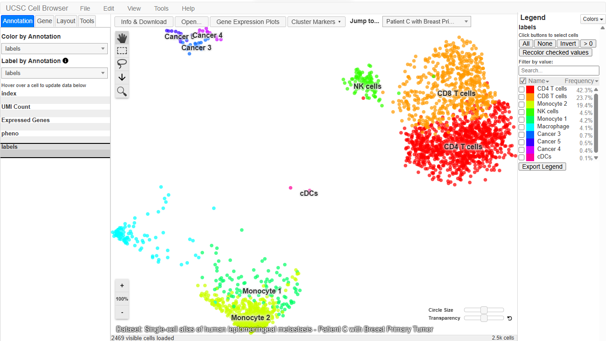
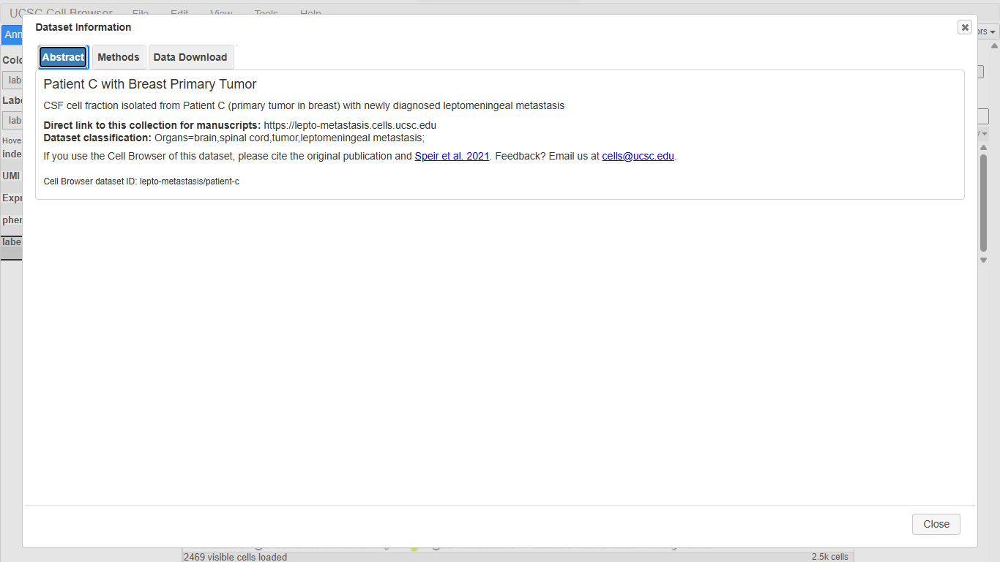
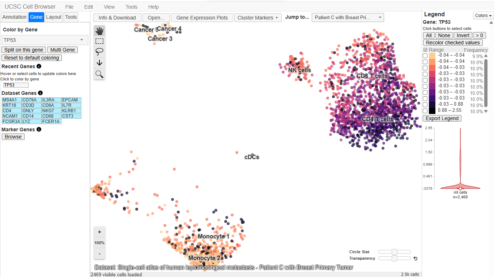
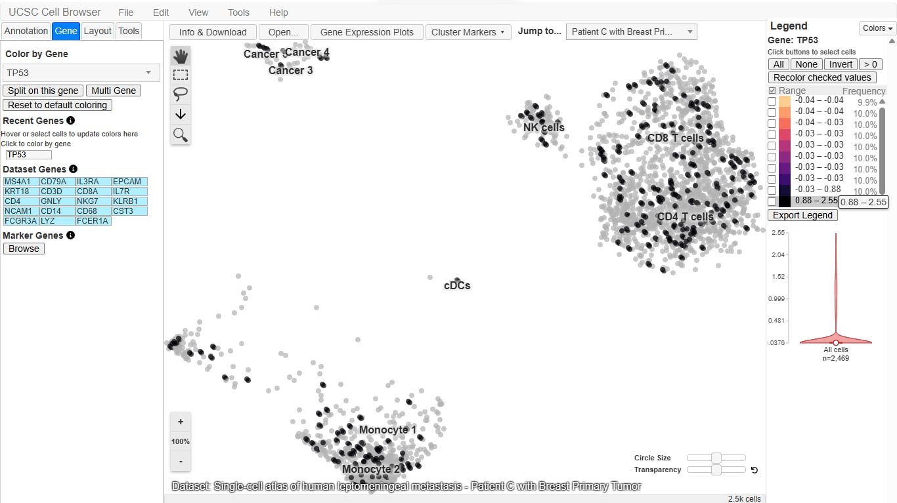
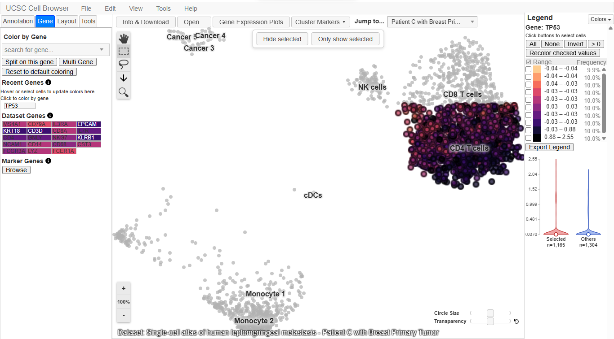
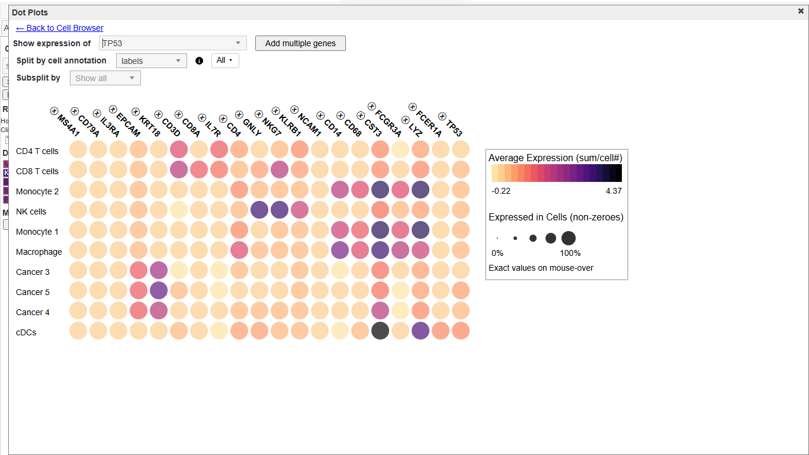

# UCSC Cell Browser Activity
**Name:** Rhealyn F. Alama

**Assigned gene:** TP53

**Associated disease:** Li-Fraumeni syndrome

**Activity:** From Genome to Cell: Exploring Disease Gene Using the UCSC Cell Browser

## Part B. Dataset
- Dataset name: Single-cell atlas of human leptomeningeal metastasis - Patient C with Breast Primary Tumor
- Organ/tissue: Cerebrospinal fluid (CSF) cells from a patient with a breast primary tumor and leptomeningeal metastasis
- Publication/study: Speir et al. 2021
- Dataset URL: (paste from address bar; dataset ID lepto-metastasis/patient-c)
- Why this tissue is relevant: Breast cancer is one of the most common cancers in Li-Fraumeni syndrome, which is caused by germline TP53 variants. This dataset comes from a patient with a breast primary tumor, so it contains breast cancer cells and the immune cells around them. The cells were taken from CSF, not from the breast itself, which limits how directly it represents breast tissue.

**Screenshot 1: Selected dataset**

## Part C. Understanding the Cell Map
- a. Type of visualization: (check the Layout tab: UMAP or t-SNE)
- b. One dot represents: one cell
- c. Clusters represent: cell types, here immune cell types and tumor cell populations
- d. Labels visible: CD4 T cells, CD8 T cells, Monocyte 1, Monocyte 2, NK cells, Macrophage, Cancer 3, Cancer 4, Cancer 5, cDCs

## Part D. Searching for TP53
- a. Gene: TP53
- b. Dataset: Patient C with Breast Primary Tumor (leptomeningeal metastasis atlas)
- c. Pattern: TP53 expression is low and widespread but sparse. It is detected in a minority of cells scattered across most clusters.
- d. Stronger expression: scattered cells in CD4 T cells, CD8 T cells, NK cells, monocytes, and macrophages, plus a few cancer cells.
- e. Little or no expression: most cells in every cluster, and the few cDCs.

**Screenshot 2: TP53 expression**

## Part E. Cell Types Expressing TP53
- a. Strongest visible expression: cDCs, based on average expression in the dot plot. This cluster has only a few cells, so the result is tentative.
- b. Another cluster with detectable expression: Cancer 5, slightly higher than the other cancer clusters (also a small cluster).
- c. Low or undetected: CD4 T cells, CD8 T cells, NK cells, monocytes, macrophages, Cancer 3, and Cancer 4 (pale in the dot plot), and most individual cells in every cluster.
- d. Pattern: broad and low, not restricted to one cell type.
- e. Interpretation (based on this dataset only): TP53 is a tumor suppressor that is active at low levels in many cell types as part of the DNA damage response, so a broad, low pattern is expected. The small differences in cDCs and Cancer 5 rest on very few cells, so I can't conclude they differ from the other clusters.

**Screenshot 3: TP53 with cell-type labels**

## Part F. Violin Plot
- a. Cells selected: 1,165 cells (about 47% of the dataset), mainly the CD4 T cell cluster
- b. Compared with the other 1,304 cells: similar. Both groups have most cells at baseline with a thin tail of higher values.
- c. What the plot adds: the map showed scattered cells with higher TP53, but the violin shows the distribution. Most cells have undetected TP53 and only a small minority are higher, and CD4 T cells are not enriched compared with the rest. The dot plot adds the average per cluster, which is low everywhere.

**Screenshot 4: Violin plot and dot plot**

